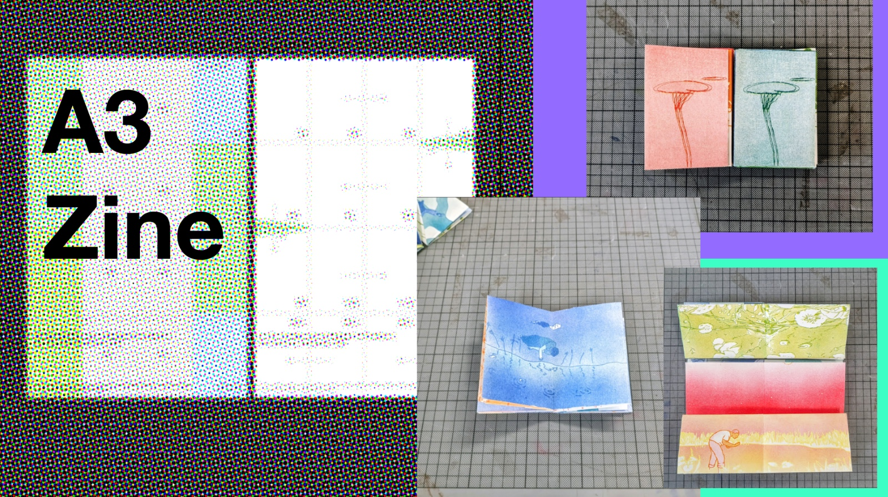
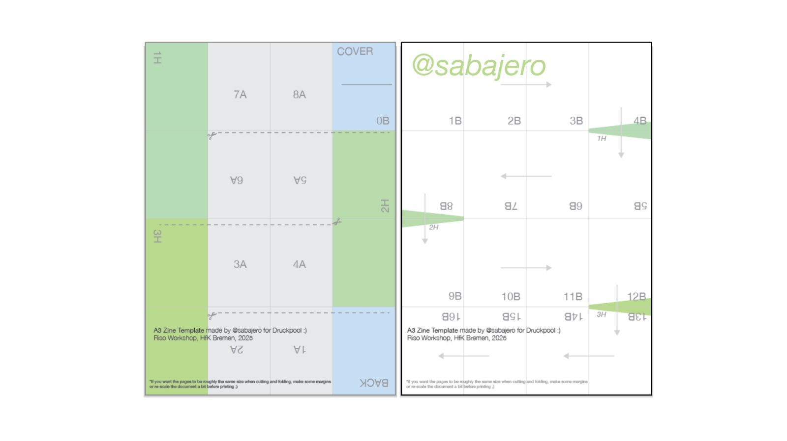

## <code>A3 Zine Template ;o </code>

*Layout

This A3 PDF template was made in a workshop by Druckpool (Riso Printing Studio from HfK Bremen) because the one they had was handmade and my workflow always make me do a template or guideline to my projects ;p - thank u people in Druckpool! -. The result is a nice A/B side Zine with each page roughly 74mm x 105mm, and the possibility of 3 "Panoramic views", of course you are free to use it and exploit it as you want! This is just a suggestion that makes for a "long" publication of basically 32 images one-page-each, with 1 A3 sheet, 2 pages and 3 cuts.

<code>It''s free btw, Paypal me [@egujeron](https://paypal.me/egujeron)  a coffee if you want or ever see this :) 
follow me on ig [sabajero](https://www.instagram.com/sabajero/)</code>

ES

Esta plantilla PDF A3 se creó en un taller de Druckpool (Riso Printing Studio de HfK Bremen) porque la que tenían era artesanal y mi flujo de trabajo siempre me obliga a crear una plantilla o guía para mis proyectos ;p - ¡Gracias a todos en Druckpool! -. El resultado es un bonito fanzine con cara A/B, cada página de aproximadamente 74 mm x 105 mm, y la posibilidad de 3 vistas panorámicas. ¡Por supuesto, puedes usarlo y aprovecharlo como quieras! Esto es solo una sugerencia para una publicación extensa de básicamente 32 imágenes de una página cada una, con 1 hoja A3, 2 páginas y 3 recortes.

Por cierto, es gratis. Invítame a un café si quieres o si alguna vez ves esto. :)
